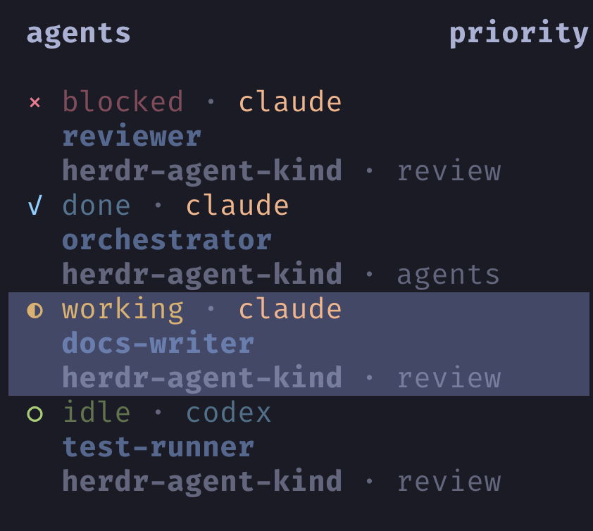

# herdr-agent-kind

Tell Claude from Codex at a glance in [Herdr](https://herdr.dev)'s agents
sidebar, even after you have named your agents.



Herdr's built-in `agent` token shows an agent's name when it has one and its
kind only when it does not. Every agent started through `herdr agent start`
has a name, and so does every session you show by title, so in practice the
kind is what disappears. This plugin publishes it as a separate `$agent_kind`
token, so a row can show both. It decides only what the token contains;
colour, weight and placement stay in your Herdr config. If your rows never
show a name, the `agent` token already shows the kind and you do not need this.

## Install and set up

```sh
herdr plugin install gregsantos/herdr-agent-kind
```

A plugin runs as your user with no sandbox. This one runs two Herdr commands,
`python3`, and writes one opt-in log file; [SECURITY.md](SECURITY.md) lists all
of it in two minutes.

Installing alone changes nothing on screen. The plugin publishes the value and
your sidebar rows decide whether it renders. This is the config behind the
screenshot. Herdr does not merge `rows` with its default: whatever you write is
the whole layout, so a row containing only `$agent_kind` would show only the
kind. Either paste this block whole in place of any `[ui.sidebar.agents]`
section you have, or add the token to the rows you already use, which the next
section covers. The `rules` need Herdr 0.9.0.

The config is `~/.config/herdr/config.toml`. Herdr writes it on first run with
every option present as a commented-out default, so you will most likely find a
`[ui.sidebar.agents]` header already there with `# rows = ...` beneath it.
Replace that block, header included: TOML allows one `[ui.sidebar.agents]` per
file, and a second header is an error. If the section is missing, paste the
block anywhere at top level, outside any other `[section]`. Run
`herdr config check` before reloading; it prints the same diagnostics the
reload would.

<a id="the-complete-layout"></a>

```toml
[ui.sidebar.agents]
rows = [
  # Row 1 leads with state_icon: it renders flush left while later rows indent
  # past the icon gutter. Kinds without a rule stay dim.
  ["state_icon", "state_text", { token = "$agent_kind", dim = true, rules = [
    { equals = "claude", fg = "#fab387", dim = false },
    { equals = "codex", fg = "#74c7ec", dim = false },
  ] }],
  # The Herdr agent handle: the name you target with `herdr agent ...`.
  [{ token = "agent", fg = "#89b4fa", bold = true }],
  [{ token = "workspace", dim = true }, { token = "tab", dim = true }],
]
```

Then apply the config and fill in the token for agents that were already
running. The plugin publishes when an agent is detected, so existing panes stay
empty until something triggers a publish:

```sh
herdr server reload-config
herdr plugin action invoke gregsantos.agent-kind.refresh
```

`reload-config` reports invalid tokens in its `diagnostics` array; an empty
array means the rows parsed. Every row now shows the name you passed to
`herdr agent start <name>`, whatever the kind. Pass the same name to Claude too
(`-- -n <name>`) so `claude --resume` finds the session by it later.

## Adjusting the layout

**Keeping your own rows.** Add `$agent_kind` wherever you want it. Against
Herdr's default, which gained a `machine` token in 0.9.0, so check yours:

```toml
[ui.sidebar.agents]
# 0.9.0 default:  rows = [["state_icon", "machine", "workspace", "tab"], ["agent"]]
# 0.8.2 default:  rows = [["state_icon", "workspace", "tab"], ["agent"]]
rows = [["state_icon", "machine", "workspace", "tab"], ["agent", "$agent_kind"]]
```

**Colour per kind.** Text tokens take up to 16 ordered `rules`, each with one
condition (`equals`, `contains`, `starts_with`, `gt`, `lt`) plus optional
`fg`, `bold` and `dim`. First match wins; unspecified fields inherit the
token's own style, so kinds you did not name stay dim rather than borrowing a
colour. Match Herdr's canonical ids, lowercase, as listed by
`herdr server agent-manifests`: `claude`, `codex`, `gemini`, `pi`, `copilot`
and so on. `equals` is case-sensitive. On Herdr 0.8.2 `rules` do not exist;
give `$agent_kind` a single fixed style instead.

**Which name to show.** `agent` is the Herdr handle: the name you pass to
`herdr agent start <name>` and the name every `herdr agent` command targets,
the same for every kind. An agent you started by hand has none until you give
it one, which works from inside its own pane:

```sh
herdr agent rename "$HERDR_PANE_ID" orchestrator
```

`terminal_title_stripped` is whatever the agent itself puts in the terminal
title. Claude sets it to the session name from `claude -n <name>`; Codex has no
such flag and titles its terminal after the working directory; other kinds
vary. If you prefer titles, `rows_by_agent` swaps the rows for one kind. This
shows the handle for Codex alone and leaves the others on their titles:

```toml
[ui.sidebar.agents.rows_by_agent]
codex = [
  ["state_icon", "state_text", { token = "$agent_kind", fg = "#74c7ec" }],
  [{ token = "agent", fg = "#89b4fa", bold = true }],
  [{ token = "workspace", dim = true }, { token = "tab", dim = true }],
]
```

## How it works

Pane metadata in Herdr is runtime-only and never written to `session.json`, so
it does not survive a server restart. The plugin publishes on two hooks:
`[[startup]]` sweeps every pane hosting an agent, which is what restores the
tokens after a restart, and `[[events]] on = "pane.agent_detected"` publishes
for one pane the moment Herdr detects an agent in it. Both shell out to
`herdr pane report-metadata <pane> --source agent-kind --token
agent_kind=<kind>`. No compiled binary, no polling, no daemon.

## Update

There is no `herdr plugin update` in plugin v1. Reinstalling refreshes the
managed checkout in place, leaves your config and the plugin's own state alone,
and keeps already-published tokens live:

```sh
herdr plugin install gregsantos/herdr-agent-kind            # follow main
herdr plugin install gregsantos/herdr-agent-kind --ref v0.5.3   # or pin
herdr plugin list --plugin gregsantos.agent-kind             # what is installed
```

[CHANGELOG.md](CHANGELOG.md) flags the two cases that need one more step. If a
release changes what gets published, run the `refresh` action, since
`[[startup]]` hooks do not re-run on reinstall. If a release renames the token,
update `rows` and run `herdr server reload-config`. A linked local checkout has
to be unlinked before `plugin install` is accepted; see
[CONTRIBUTING.md](CONTRIBUTING.md).

## Requirements

- Herdr 0.8.2 or later, verified on 0.8.2 and 0.9.0. Per-kind colour `rules`
  need 0.9.0.
- `python3`, to parse Herdr's JSON. If it is missing the plugin exits non-zero
  with a message rather than silently publishing nothing.
- Any POSIX shell; verified under dash, bash, zsh and macOS `/bin/sh`.
- macOS or Linux.

## Troubleshooting

Two symptoms that look like plugin faults but are not:

- **The sidebar still shows your previous layout.** Herdr reads `config.toml`
  only at startup and on `herdr server reload-config`. This bites hardest when
  the config arrives by dotfiles sync onto a second machine, because there is no
  moment where you would think to reload.
- **The row renders but the kind is absent.** The layout is live and the token
  is empty: that agent was already running when the plugin was installed. Run
  the `refresh` action.

For anything else, Herdr records the exit code and output of every hook run:

```sh
herdr plugin log list --plugin gregsantos.agent-kind
herdr pane get w1:p2              # look for "tokens": {"agent_kind": "..."}
```

Diagnostics are off by default. Turn them on for a machine and each run logs the
event, its payload and every publish outcome to
`$HERDR_PLUGIN_STATE_DIR/agent-kind.log`, readable only by you. For a one-off,
set `HERDR_AGENT_KIND_DEBUG=1` instead. The log goes only to the state directory
Herdr provides, so running the script by hand outside Herdr never writes one.

```sh
touch "$(herdr plugin config-dir gregsantos.agent-kind)/debug"
```

## Uninstall

```sh
herdr plugin uninstall gregsantos.agent-kind
```

Then remove `$agent_kind` from your rows and run `herdr server reload-config`. A
token left in the config is harmless and renders as nothing. Panes keep their
last published value until the server restarts; to clear one now:

```sh
herdr pane report-metadata w1:p2 --source agent-kind --clear-token agent_kind
```

## Limitations

- When an agent exits and its pane returns to a shell, the pane keeps a stale
  `agent_kind` token. It is never rendered, because the agents sidebar lists
  only panes that currently host an agent.
- A failed publish is logged, not raised, so the hook exits 0 and the plugin log
  stays green. Enable diagnostics to see publish failures. The one deliberate
  exception is a missing `python3`, which exits non-zero with a message.

## Upstream

This plugin exists because Herdr has no built-in token for the kind, and it
should become unnecessary. The request for one is Herdr issue
[#3335](https://github.com/herdrdev/herdr/issues/3335), closed as not planned
by triage, with product discussion continuing in
[discussion #3694](https://github.com/herdrdev/herdr/discussions/3694). If you
want the token native, an upvote there is the way to say so. When Herdr ships
one, switch your rows to it and uninstall this.

## License

MIT
